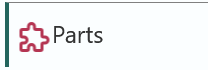
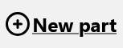
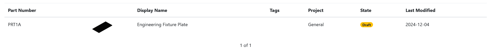
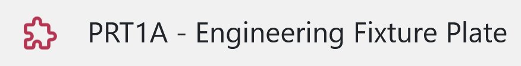
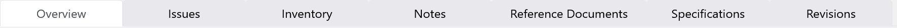

# Creating your first **Part**

Click on **Parts** in the sidebar: &nbsp;  &nbsp; or go to /parts in your browser.

Next click on **New part** &nbsp; 

A modal dialog will open, enter your information about the new part, then hit submit when you are done: &nbsp; 

---

## **Part** dashboard

Navigate to the part by clicking on it in the table, or *open it in a new tab* by using **ctrl** + click.

Now you can see your newly created part! On the top of the screen you have the *part number* and its *display name*.

<small><b>Tip!</b> Click on this to copy the part number + display name to your clipboard.</small>

Use the navigation tab to manage different aspects of your part

Tabs tl;dr:

- **Overview**: See the *MPN*, *Manufacturer*, edit your part's *tags*, view and edit pricing data, upload files, edit the *errata* or *revision notes*, and link *alternative parts*.
- **Issues**: Create, edit and manage issues on your part.
- **Inventory**: Take or remove stock from your *locations*, view forecast and history. 
- **Notes**: Inline markdown editor for easy and quick jotting.
- **Reference Documents**: Link documents to your part for easy access and later reference.
- **Specifications**: Define custom technical specifications for your part.
- **Revisions**: View all the other versions of this part you've created.

---