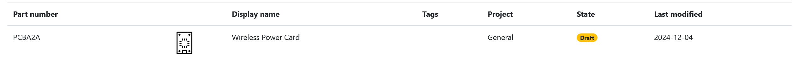
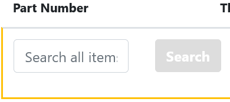
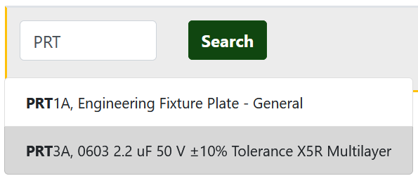
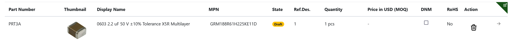
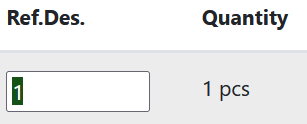
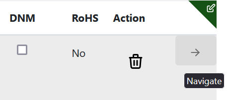

# From Parts to PCBAs

*PCBAs* are connected to Parts via its *BOM*. PCBAs can be used in other PCBAs or in other Assemblies. To use your parts to create a PCBA start by creating a new PCBA in dokuly.

<small><b>Note!</b> Parts, PCBAs, and Assemblies share a counter for their part numbers.</small>

## Create a new PCBA

    Click on **PCBA** in the sidebar: &nbsp;  &nbsp; or go to /pcbas in your browser.

    Next click on **New PCBA** &nbsp; 

    A modal dialog will open, enter your information about the new PCBA, then hit submit when you are done: &nbsp; 

Navigate to the PCBA by clicking on it in the table, or *open it in a new tab* by using **ctrl** + click.

---

## **PCBA** dashboard

The dashboard for your PCBAs is pretty similar to the **Part** dashboard. Edit the metadata for your PCBA, update pricing data, upload files, and write errata notes. In addition, you also have access to issues, inventory, notes, reference documents and revisions, the same as the part dashboard. 

---

## Connecting parts to your PCBA

When on the PCBA dashboard, click on the tab named **Bill of Materials**. Here you can manage the list of parts that make up your PCBA. 

To add a new connection in your BOM:

<ol>
  <li>
    Click &nbsp; 
  </li>
  <li>
    Click on the "-" in the <strong>Part Number</strong> column, this will trigger the inline part search: 
     
    
  </li>
  <li>
    Enter part name or number, click search, then click on the part you want to add to the BOM:
     
    
  </li>
  <li>
    The part is now added to your BOM!
     
    
  </li>
</ol>

The rows in the table can be updated with in-line edit to change quantity, *Ref.Des*, and more.
To perform an inline edit:

1. Click on the value you want to edit.
    

2. Update the value, then hit **Tab** or **Enter** to submit your change.

<small><b>Tip!</b> You can navigate to a BOM item quickly by using **Ctrl** + click on the table row, or clicking on the right arrow (->) icon.</small>
    

---

## Next step

<a href="/pcbas_and_assemblies">Further details on BOM for PCBAs and Assemblies</a>